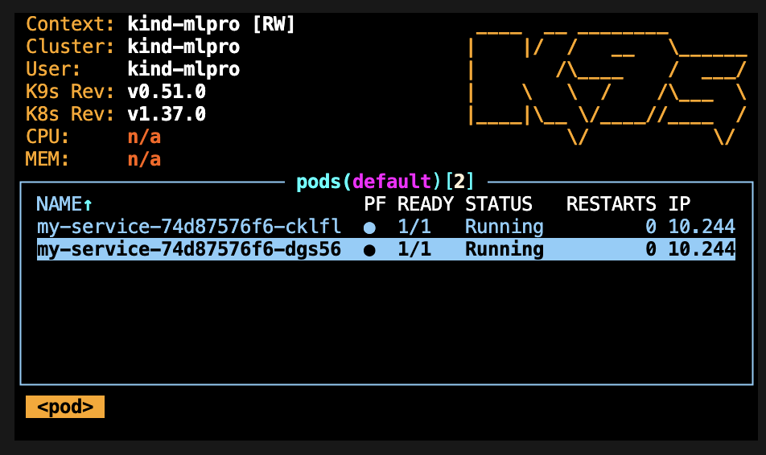
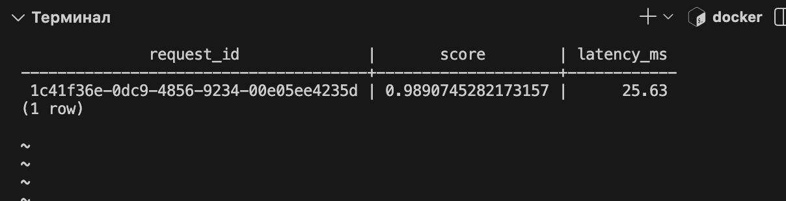
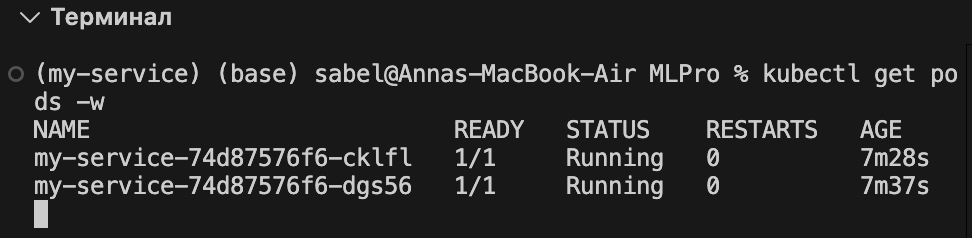
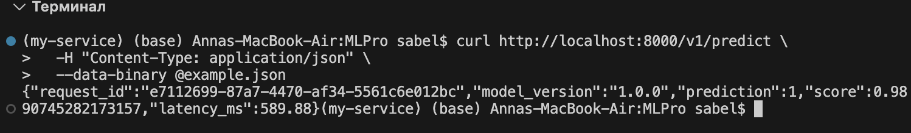

# Скрины терминала

## pytest

## SELECT из логов

## get pods

## predict через port‐forward


# Скрин k9s 


# Журнал проблем

| Лог ошибки | Описание | Решение |
| --- | --- | --- |
| `can't open file '/Users/sabel/Documents/MLPro/‐c': [Errno 2] No such file or directory` | Вместо обычного дефиса `-` стоял Unicode-дефис `‐`. Python воспринял `‐c` как имя файла. | Заменить дефис и убрать обратный слеш перед подчёркиванием: `uv run python -c "import my_service"`. |
| `AttributeError: Can't get attribute 'SequencePreprocessor' on <module '__main__' from '.../.venv/bin/uvicorn'>`<br>`ERROR: Application startup failed. Exiting.` | Модель сохранена из ноутбука со ссылками на классы в `__main__`. При запуске сервиса этим модулем стал uvicorn. | Вынести `SequencePreprocessor`, `TinySequenceEncoder` и `TinyTransformerClassifier` в `src/my_service/model.py`. В `model_loader.py` сопоставить старые ссылки с классами и использовать `load_model()` в `lifespan`. Также исправлены вход `(1, 48, 3)` через `to_model_input()` и ответ по схеме `Prediction`. Запуск и предсказание проверены. |
| `ERROR: Error loading ASGI app. Could not import module "my_service.main".` | Dockerfile запускал `my_service.main:app`, но приложение находится в `src/my_service/service/app.py`. | В `CMD` указать `my_service.service.app:app`. Пересобрать образ: `docker build -t my_service:1.0 .`. Запустить: `docker run --rm -p 8000:8000 my_service:1.0`. |
| `failed to solve: failed to read dockerfile: open Dockerfile: no such file or directory` | Контекст сборки был `./src/my_service`, а Dockerfile лежит в корне проекта. | В секции `build` файла `compose.yaml` указать `context: .` и `dockerfile: Dockerfile`. Проверка `docker compose config --quiet` прошла. Повторный запуск: `docker compose up -d --build`. |
| `Deployment.apps "my_service" is invalid: metadata.name: Invalid value: "my_service"`<br>`Service "my_service" is invalid: metadata.name: Invalid value: "my_service"` | Подчёркивание недопустимо в именах этих ресурсов Kubernetes. | Заменить `metadata.name` на `my-service` в обоих манифестах. Имя образа `my_service:1.0` и совпадающие labels/selector менять не нужно. Применить: `kubectl apply -f k8s/`. |
| `stream closed: EOF for default/my-service-5554f489fb-p65hm (api)`<br>Из `kubectl describe pod`:<br>`Status: Pending`<br>`Node: <none>`<br>`FailedScheduling: 0/1 nodes are available: 1 Insufficient memory.` | Pod ещё не запускался, поэтому логов не было. В `requests` и `limits` указано `1000000000Mi` — почти петабайт памяти на pod. | Заменить память на `1Gi` в `requests` и `limits`. Применить: `kubectl apply -f k8s/`. Проверить состояние: `kubectl get pods -w`. |

# Нагрузочное тестирование

| Пользователей | RPS | median, мс | p95, мс | max, мс | Доля ошибок |
| ---: | ---: | ---: | ---: | ---: | ---: |
| 10 | 6,56 | 15 | 53 | 673,44 | 0% |
| 50 | 32,39 | 10 | 39 | 355,11 | 0% |
| 100 | 63,20 | 9 | 220 | 1662,89 | 0% |

При 10 и 50 пользователях p95 превышал медиану примерно в 3,5–4 раза, а при 100 разрыв резко вырос: 220 мс против 9 мс, то есть примерно в 24 раза. При переходе от 50 к 100 пользователям RPS вырос с 32,39 до 63,20 — почти вдвое, поэтому по этим прогонам предел пропускной способности ещё не установлен. При этом максимальная задержка достигла 1,66 с: часть запросов стала заметно медленнее, хотя медиана осталась низкой. Locust не зарегистрировал ошибок ни в одном прогоне.

# Batch-предсказания

`POST /v1/predict/batch` принимает `{"rows": [Features, ...]}`: от 1 до 1000 окон. Для последовательностной модели вместо DataFrame собирается один массив `(N, 48, 3)`, затем один раз вызывается `pipeline.predict_proba`. Ответ содержит `request_id`, `model_version`, `predictions` (класс и score для каждого окна в исходном порядке) и общий `latency_ms`.

| Окон в запросе | Медиана latency_ms, мс |
| ---: | ---: |
| 1 | 4,88 |
| 500 | 69,49 |

500 окон в одном запросе оказались примерно в 14,24 раза дороже одного окна, хотя объём входа вырос в 500 раз. Рост меньше линейного благодаря обработке массивов и матричным операциям PyTorch, а также распределению постоянных затрат вызова на весь batch; внутри классификатора окна обрабатываются порциями по `batch_size`, поэтому один вызов pipeline не означает один проход нейросети.

Повторить замер в Compose:

```bash
docker compose exec -T api .venv/bin/python - --stdout-only < tests/load_testing/benchmark_batch.py > tests/load_testing/results/batch_benchmark.json
```
# Выкат версии 1.1 и откат

Образ `my_service:1.1` содержит `/v1/predict/batch`, которого нет в `1.0`. Выкат выполнен в kind-кластере `mlpro`:

```bash
docker build -t my_service:1.1 .
kind load docker-image my_service:1.1 --name mlpro
kubectl set image deploy/my-service api=my_service:1.1
kubectl rollout status deploy/my-service
kubectl rollout undo deploy/my-service
kubectl rollout status deploy/my-service
kubectl rollout history deploy/my-service
```

Вывод `rollout history` после отката:

```text
deployment.apps/my-service
REVISION  CHANGE-CAUSE
1         <none>
3         <none>
4         <none>
```

Ревизия 3 соответствует выкату `1.1`, ревизия 4 — возврату шаблона `1.0` из ревизии 2; откат сам создаёт новую ревизию. После отката: образ `my_service:1.0`, `READY 2/2`, `AVAILABLE 2`.

Поды заменялись по одному: новая реплика переходила в Ready, после чего старая завершалась; откат аналогично вернул `1.0` без batch-эндпоинта. Две реплики, RollingUpdate и readiness-проба позволяли сохранять готовые поды во время замены, но не гарантировали успех каждого запроса. Утверждать «сервис не молчал ни секунды» по этому прогону нельзя: из 300 циклов проверки через Service два дали таймаут `/health`, ещё три — ошибку `/openapi.json` после успешного health; точная причина этих сбоев отдельно не установлена.
