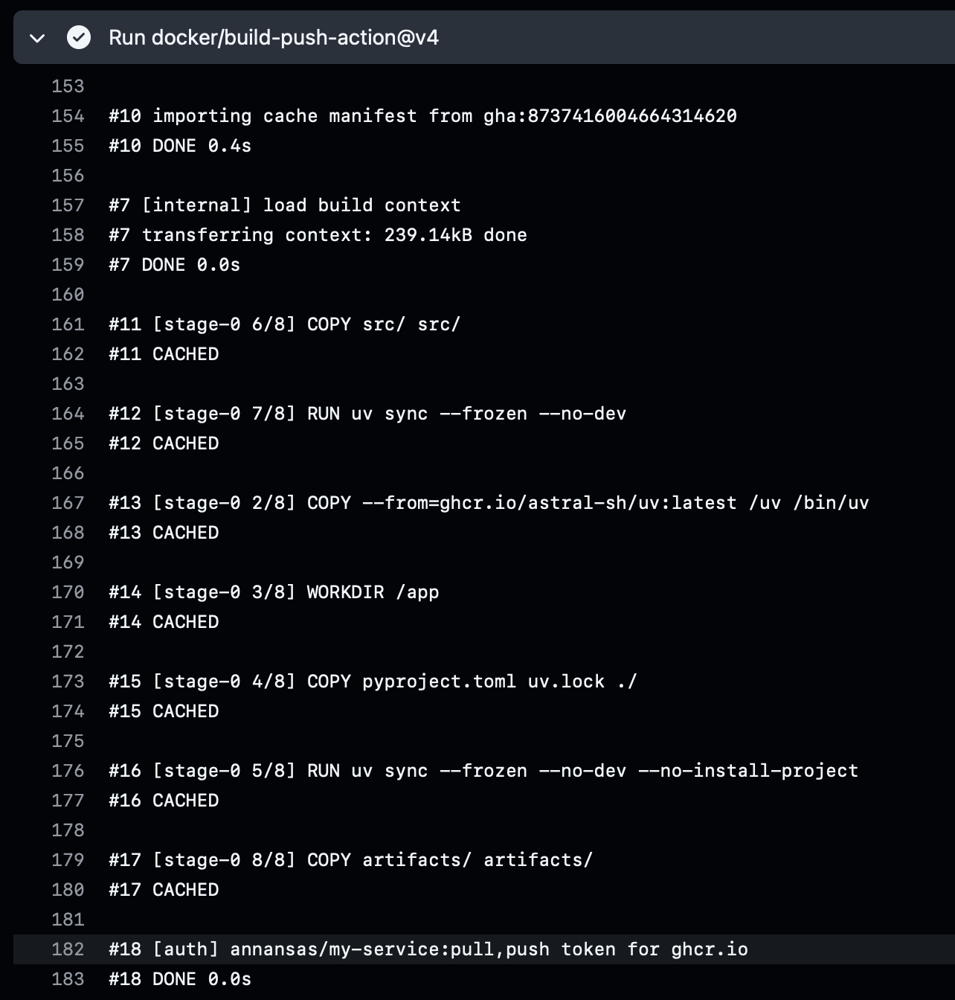

# Домашняя работа 2 — CI/CD

Пайплайн: [.github/workflows/ci.yml](.github/workflows/ci.yml).

| Пункт | Ссылка |
|---|---|
| Пайплайн | Зелёный прогон с `tests`, `build`, `deploy` https://github.com/AnnAnsas/MLPro/actions/runs/36337616624|
| Образ | Страница пакета GHCR с SHA-тегом https://github.com/AnnAnsas/MLPro/pkgs/container/my-service|
| Pull request | PR с красной и зелёной проверками https://github.com/AnnAnsas/MLPro/pull/4/commits - коммиты add deploy stage и fix pg_advisory_xact_lock|
| Неверный путь модели | Красный - https://github.com/AnnAnsas/MLPro/actions/runs/36339889000/job/108677965125 и зелёный - https://github.com/AnnAnsas/MLPro/actions/runs/36340894825/job/108680932503 прогоны, диагноз - в ConfigMap указан неверный путь к модели. Job deploy упал на шаге service: rollout завершился по таймауту. Диагностика показала FileNotFoundError при загрузке artifacts/tiny_sequence_transformer.joblib. После восстановления пути artifacts/tiny_sequence_transformer_v1.joblib приложение запустилось, пайплайн прошёл успешно.|
| Неверное имя Secret | Красный - https://github.com/AnnAnsas/MLPro/actions/runs/36342219784 и зелёный прогоны, диагноз - Job deploy упал на шаге service: rollout завершился по таймауту. Новый под получил статус CreateContainerConfigError, поскольку Deployment ссылался на неверное имя обязательного Secret — my-service-secrets-wrong. PostgreSQL при этом работал (1/1 Running).|
| Недостаточно памяти | Красный - https://github.com/AnnAnsas/MLPro/actions/runs/36341276351/job/108681942976 и зелёный - https://github.com/AnnAnsas/MLPro/actions/runs/36341896111 прогоны, диагноз - Job deploy упал на шаге base: PostgreSQL не достиг готовности за 180 секунд. Под остался в состоянии Pending, узел ему не назначен (NODE none). До развёртывания my-service пайплайн не дошёл, поэтому диагностика приложения вернула NotFound. Полезно добавить diagnostics kubectl describe pods / kubectl get events --sort-by=.metadata.creationTimestamp |

## Ответы на вопросы

### 1. Сколько времени занял build и какой слой использовал кэш?

В [первом прогоне](https://github.com/AnnAnsas/MLPro/actions/runs/36337616624) job `build` занял 14 минут 22 секунды (862 секунды), во [втором](https://github.com/AnnAnsas/MLPro/actions/runs/36339889000) — 22 секунды, примерно в 39 раз меньше. На скриншоте выше отметка `CACHED` есть у слоя `RUN uv sync --frozen --no-dev --no-install-project`, а также у копирования исходников, артефакта и остальных показанных слоёв. Docker восстановил кэш из GitHub Actions: команды и входные файлы этих слоёв не изменились. Установка зависимостей расположена до копирования кода, поэтому при изменениях только в `src/` слой зависимостей также может использоваться повторно.

### 2. Почему ImagePullBackOff может появиться при зелёном deploy?

В `k8s/deployment.yaml` первоначально указан образ `my_service:1.0`, а в кластер CI загружается образ из GHCR с тегом `sha-<SHA коммита>`. Между `kubectl apply` и `kubectl set image` поды первоначального ReplicaSet могут попытаться скачать отсутствующий образ и получить `ImagePullBackOff`. После обновления Deployment новые поды используют загруженный SHA-образ, а старые заменяются. Поэтому временная ошибка старых подов не делает прогон красным, если rollout новой версии успешно завершился.

### 3. Как пароль базы попадает из GitHub в под?

Пароль хранится в GitHub Actions Secret `DB_PASSWORD` и передаётся в переменную окружения шага `load secrets`. Этот шаг создаёт Kubernetes Secret `my-service-secrets` с ключами `POSTGRES_PASSWORD` и `DATABASE_URL`, причём пароль включается в строку подключения. PostgreSQL получает пароль через `secretKeyRef`, а API получает `DATABASE_URL` через `envFrom.secretRef`. ConfigMap предназначена для несекретных настроек; пароль нельзя хранить в её YAML в репозитории, а доступ к самому Kubernetes Secret тоже необходимо ограничивать.

### 4. Что произойдёт, если убрать needs: tests у build?

Без `needs: tests` сборка сможет выполняться параллельно с тестами. Например, интеграционный тест обнаружит, что сервис не пишет предсказания в PostgreSQL, но build уже успеет опубликовать неисправный образ. Job `deploy`, зависящий от build, сможет начать развёртывание независимо от результата tests. Зависимость не позволяет передать дальше образ из коммита, который не прошёл проверки.

### 5. Почему на pull request запускаются только тесты?

У job `build` стоит условие `if: github.ref == 'refs/heads/main'`. Для события pull request GitHub использует ref вида `refs/pull/<номер>/merge`, поэтому build пропускается; deploy также пропускается из-за зависимости `needs: build`. После merge происходит push в `main`, и при успешных тестах запускается вся цепочка. Так изменения проверяются до слияния, а образ публикуется и развёртывается после него.

### 6. Зачем в init() используется pg_advisory_xact_lock?

В Kubernetes запущены две реплики API, и каждая при старте вызывает `init()` для одной базы. `pg_advisory_xact_lock(7001)` разрешает выполнять создание и обновление таблицы только одной такой транзакции, пока другая ждёт. Без блокировки при одновременном старте на пустой базе возможна гонка создания объектов, даже с `CREATE TABLE IF NOT EXISTS`. Блокировка освобождается при завершении транзакции; речь о репликах API, а не PostgreSQL.

### 7. В каком порядке возникают состояния подов при трёх поломках?

По этапам запуска порядок такой: `Pending` → `CreateContainerConfigError` → `CrashLoopBackOff`. При нехватке запрошенной памяти под не получает узел и остаётся `Pending`; именно отсутствие назначенного узла видно в [прогоне с поломкой ресурсов](https://github.com/AnnAnsas/MLPro/actions/runs/36341276351/job/108681942976). При неверном имени Secret контейнер нельзя подготовить к запуску (`CreateContainerConfigError`), а при неверном пути модели приложение уже запускается и падает с `FileNotFoundError`, после повторных падений переходя в `CrashLoopBackOff`. Это отдельные эксперименты, расположенные по этапам жизни пода, а не последовательность состояний одного пода.
