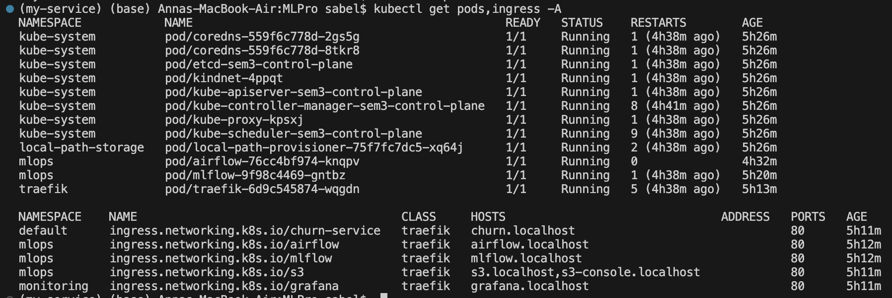
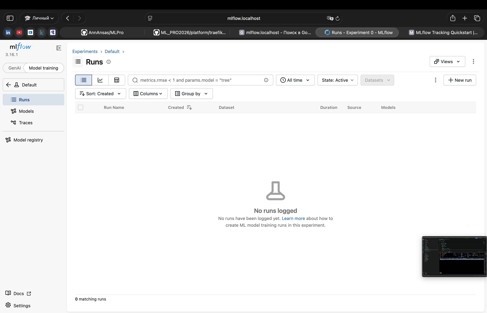

# Домашняя работа 3 — модель из реестра в своём кластере

## 1. Платформа в kind (пункт 2.1)

Создан кластер `sem3` из [kind-config.yaml](platform/kind-config.yaml): порт `127.0.0.1:80` проброшен на `30080` узла, где принимает запросы Traefik. MLflow 3.16.1 открывается по адресу `http://mlflow.localhost` в режиме **Model training**. Прогонов обучения пока нет.

| Пункт задания | Ссылка или скрин | Результат |
|---|---|---|
| Поды и Ingress | [Вывод kubectl](images/hw3/get_pods_ingress.png) | Все показанные поды — `1/1 Running`; Ingress используют класс `traefik`, порт 80. |
| MLflow в режиме Model training | [Интерфейс MLflow](images/hw3/mlflow.png) | Страница эксперимента Default открывается через Ingress. |
| Настройки MLflow | [mlflow.yaml](platform/mlflow.yaml) | Заданы allowed hosts, CORS и отключение фоновых GenAI-задач. |

В манифесте MLflow:

```yaml
- --allowed-hosts=mlflow.mlops*,mlflow.localhost*,localhost*,127.0.0.1*
- --cors-allowed-origins=http://mlflow.localhost
```

```yaml
env:
  - {name: MLFLOW_SERVER_ENABLE_JOB_EXECUTION, value: "false"}
```

### Поды и Ingress



### MLflow



## Журнал проблем

| Что не получилось / ошибка | Как найдена причина | Исправление и результат |
|---|---|---|
| `helm --version`: `bash: helm: command not found` | Терминал не нашёл Helm. | Установлен через `brew install helm`. Проверка `helm version` показала `v4.3.0`. |
| `TLS handshake timeout`; controller-manager в `CrashLoopBackOff`, scheduler перезапускался | При диагностике Docker было доступно 3916 МиБ RAM, оставалось около 568–587 МиБ доступной памяти, использовался swap. Это указывает на давление на память; OOM по логам не подтверждён. | Airflow и мониторинг уменьшены до 0 реплик, Docker Desktop перезапущен. После остановки оператора Prometheus повторно уменьшен до 0. Все оставшиеся поды стали готовы, доступно 2243 МиБ. Airflow затем возвращён к 1 реплике: `1/1 Running`, доступно 1054 МиБ. Мониторинг оставлен выключенным. |
| Первые команды `kubectl scale` также завершались `TLS handshake timeout`; после `scaled` поды ещё работали | API отвечал нестабильно, controller-manager продолжал падать и не применял желаемое число реплик. | Команды повторены; после перезапуска Docker контроллер восстановился и поды остановились. |

## Команды из терминала

### Подготовка

| Команда | Что делает |
|---|---|
| `source /Users/sabel/Documents/MLPro/.venv/bin/activate` | Активирует Python-окружение проекта в текущем терминале. |
| `brew install helm` | Устанавливает Helm через Homebrew. |
| `helm version` | Показывает версию Helm. |
| `helm repo add prometheus-community https://prometheus-community.github.io/helm-charts` | Добавляет источник чартов мониторинга. |
| `helm repo add traefik https://traefik.github.io/charts` | Добавляет источник чартов Traefik. |
| `helm repo update` | Обновляет локальные индексы чартов. |
| `kind get clusters` | Показывает локальные kind-кластеры; были `mlpro` и `mlpro-hw1`. |
| `kind delete cluster --name mlpro` | Удаляет старый кластер `mlpro`. |
| `kind delete cluster --name mlpro-hw1` | Удаляет старый кластер `mlpro-hw1`. |

### Кластер и приложения

Создание кластера с пробросом порта из конфигурации; текущий контекст переключается на `kind-sem3`:

```bash
kind create cluster --name sem3 --config platform/kind-config.yaml
```

Загрузка локальных Docker-образов в узел kind:

```bash
kind load docker-image apache/airflow:3.3.2 ghcr.io/mlflow/mlflow:v3.16.1 --name sem3
```

Создание или обновление ресурсов MLflow и Airflow по манифестам:

```bash
kubectl apply -f platform/mlflow.yaml
kubectl apply -f platform/airflow.yaml
```

Установка мониторинга. `upgrade --install` обновляет существующий релиз или создаёт новый; `-n` задаёт namespace, `-f` — файл настроек, `--wait` ждёт готовности, `--timeout 15m` ограничивает ожидание:

```bash
helm upgrade --install monitoring prometheus-community/kube-prometheus-stack \
  --version 91.5.2 -n monitoring --create-namespace \
  -f platform/monitoring-values.yaml --wait --timeout 15m
```

Установка Traefik с настройками из проекта:

```bash
helm upgrade --install traefik traefik/traefik \
  --version 41.6.0 -n traefik --create-namespace \
  -f platform/traefik-values.yaml --wait
```

Создание маршрутов по именам хостов:

```bash
kubectl apply -f platform/ingress.yaml
```

### Проверки и остановка сервисов

| Команда | Что делает |
|---|---|
| `kubectl get ingress -A` | Показывает Ingress во всех namespace. |
| `kubectl get pods -A` | Показывает готовность, состояние и перезапуски всех подов. |
| `kubectl get pods,ingress -A` | Выводит поды и Ingress для подтверждения пункта 2.1. |
| `k9s` | Открывает терминальный интерфейс Kubernetes. |
| `k9s -n mlops` | Открывает k9s в namespace `mlops`. |
| `kubectl scale deployment airflow -n mlops --replicas=0` | Останавливает Airflow, сохраняя Deployment и PVC. |
| `kubectl scale deployment --all -n monitoring --replicas=0` | Останавливает Deployment мониторинга, включая Grafana и оператор Prometheus. |
| `kubectl scale statefulset --all -n monitoring --replicas=0` | Останавливает StatefulSet Prometheus; PVC не удаляется этой командой. |

